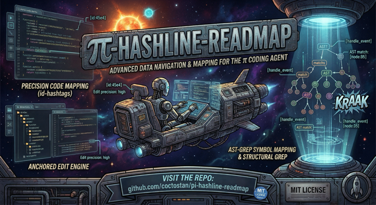

# pi-hashline-readmap



[](LICENSE)
[](https://www.npmjs.com/package/pi-hashline-readmap)

A drop-in [pi](https://github.com/mariozechner/pi-coding-agent) extension that upgrades the agent's local coding workflow with hash-anchored reads and edits, structural file maps, symbol-aware navigation, structural search, agent-optimized file exploration, and compressed `bash` output.

It replaces the stock `read`, `edit`, `grep`, `ls`, and `find` tools, provides an enhanced `ast_search` tool, adds a `nu` tool for structured exploration via Nushell, and post-processes `bash` output so more context budget goes to useful information instead of noise.

## Why install this?

If you use pi for real code changes, the stock toolchain has a few recurring problems:
- search and read output is easy for a model to paraphrase incorrectly
- follow-up edits can drift to the wrong line when the file changes
- large files cost too many tokens to navigate
- searching often requires an extra read just to understand symbol context
- raw `bash` output wastes context on noise from tests, builds, Git, linters, and package managers

`pi-hashline-readmap` fixes those problems with a single coherent package instead of stacking multiple overlapping extensions.

## Benefits

### Safer edits
`read`, `grep`, and `ast_search` return `LINE:HASH|content` anchors. Those anchors can be fed directly into `edit`, which means the model edits exactly the line it read.

```text
45:e4|router.addRoute("/api", handler);
```

That reduces wrong-line edits, makes file drift visible, and keeps surgical changes reliable.

### Faster navigation in real codebases
Instead of opening big files blindly, the `read` tool can append a structural map of classes, functions, methods, and ranges. You can jump directly to the relevant symbol or section.

### Better local code understanding
This package stays focused on local file and symbol work:
- symbol lookup in `read`
- symbol-scoped grep with enclosing symbol blocks
- local same-file support bundles for `read(symbol=...)`
- structural code search via `ast_search`

That gives agents more context without turning this package into a repo-wide code graph tool.

### Lower context waste from shell output
`bash` output is filtered and compressed for common noisy commands, including test runners, build tools, Git, Docker, linters, and package managers.

### One extension instead of extension conflicts
A common pi failure mode is installing several packages that all want to own `read`, `grep`, or `edit`. This package intentionally unifies those improvements in one place.

## Common use cases

This package is a good fit when you want pi to:
- make precise, anchor-safe edits in source files
- inspect large files without reading the entire file
- jump directly to a function, method, or class by name
- search for code and immediately edit the result without an extra cleanup read
- search within enclosing symbols instead of only matching lines
- inspect a symbol together with nearby same-file support code
- run tests or builds without flooding the model context with irrelevant output
- explore directory structure with sorted, dirs-first listings
- find files recursively with gitignore-aware, depth-limited discovery

## What this package includes

## `read`
- `LINE:HASH|content` output
- structural maps via `map: true`
- automatic map append on truncated reads
- symbol lookup via `symbol`
- local symbol bundles via `bundle: "local"`
- image delegation to pi’s built-in image handling
- binary detection and display-safe control character escaping
- custom TUI rendering with symbol, map, warning, and truncation badges

### `read` feature details
- Structural maps support **19 languages**: TypeScript, JavaScript, Python, Rust, Go, C, C++, Swift, Shell/Bash, Clojure, SQL, JSON, JSONL, Markdown, YAML, TOML, CSV, and related mapped variants in the readmap engine. The Swift mapper recognizes classes, actors, structs, enums, protocols, extensions, functions (including operator overloads), and deinit lifecycle blocks.
- `symbol` and `map` are mutually exclusive.
- `symbol` cannot be combined with `offset` or `limit`.
- `bundle: "local"` requires `symbol` and cannot be combined with `map` or `offset`.

## `edit`
- hash-verified anchored edits using `LINE:HASH` anchors from `read`, `grep`, or `ast_search`
- operations: `set_line`, `replace_lines`, `insert_after`, `replace`
- compact diff and full diff support
- mismatch diagnostics with context
- custom TUI rendering with diff stats and warnings
- additive semantic summaries in structured output

### Semantic edit classification
After each successful edit, `details.ptcValue.semanticSummary` classifies the change as:
- `no-op`
- `whitespace-only`
- `semantic`
- `mixed`

When [difftastic](https://difftastic.wilfred.me/) (`difft`) is installed, classification uses AST-aware diffing for better formatting-only detection and moved-block summaries. When difftastic is unavailable or fails, the tool falls back silently to internal heuristics.

The success text output stays unchanged. Semantic classification is additive metadata only.

## `grep`
- hash-anchored matches ready for direct use with `edit`
- context lines with deduped and merged windows
- `summary: true` mode for per-file match counts
- result truncation indicators
- symbol-scoped results via `scope: "symbol"`
- custom TUI rendering with match distribution and truncation badges

### Symbol-scoped grep
With `scope: "symbol"`, matches are grouped by their enclosing function, method, class, or other mapped symbol when possible. Unsupported files and unmappable cases fall back gracefully to normal grep output.

## `ast_search`
- wraps [ast-grep](https://ast-grep.github.io/) for structural code search
- returns merged, hash-anchored match blocks grouped by file
- ideal for structure-aware search → edit workflows
- custom TUI rendering
- requires `ast-grep` installed locally

## `bash` output compression
The extension post-processes `bash` tool results to reduce noise while preserving the useful parts.

Specialized compressors currently cover:
- test runners
- build tools
- compiler / bundler noise
- Git output
- linter output
- Docker output
- package manager output
- HTTP client output
- transfer tools
- file listing output
- oversized generic output via smart truncation

ANSI escape stripping runs on all bash output regardless.

## `nu`
When [Nushell](https://www.nushell.sh/) is installed, the extension registers a `nu` tool for structured exploration — file inspection, data wrangling, and system queries via Nushell pipelines.

The `nu` tool's prompt advertises several optional Nushell plugins that enhance agentic coding workflows when installed:

| Plugin | Commands | What it does |
|--------|----------|--------------|
| `nu_plugin_gstat` | `gstat` | Structured git status — branch, ahead/behind, staged/unstaged counts, conflicts |
| `nu_plugin_query` | `query json`, `query xml`, `query web` | JSONPath, XPath, and CSS selector queries on structured data |
| `nu_plugin_formats` | `from ini`, `from plist` | Parse INI and plist config file formats into structured records |
| `nu_plugin_semver` | `into semver`, `semver bump` | Parse, compare, sort, and bump SemVer versions |
| `nu_plugin_file` | `file` | Detect file type from magic bytes instead of extension |

These plugins are **not bundled** — they must be installed separately. See [Optional Nushell plugins](#optional-nushell-plugins) below.

## `ls`
Agent-optimized single-directory listing. Shows directories first (with `/` suffix), then files, sorted alphabetically (case-insensitive). Always includes dotfiles.

- `path` — directory to list (default: cwd)
- `limit` — max entries (default: 500)
- `glob` — filter entries by pattern (e.g. `'*.ts'`)

Returns structured `ptcValue` with `{ tool, path, totalEntries, truncated, entries[] }`. Output is bounded by both entry count and a 50 KB byte budget.

## `find`
Recursive file discovery optimized for agents. Uses [`fd`](https://github.com/sharkdp/fd) when available for speed, falls back to pure Node.js. Respects `.gitignore` (including nested), always includes hidden files.

- `pattern` — glob pattern (**required**, e.g. `'*.ts'`)
- `path` — search directory (default: cwd)
- `limit` — max entries (default: 1000)
- `type` — `"file"` | `"dir"` | `"any"` (default: `"file"`)
- `maxDepth` — maximum directory depth

Returns sorted relative paths with forward slashes and structured `ptcValue`. Output bounded by entry count and 50 KB byte budget.

## Quick Start

### Install from npm
```bash
pi install npm:pi-hashline-readmap
```

### Install from GitHub
```bash
pi install git:github.com/coctostan/pi-hashline-readmap
```

### Optional local tools
```bash
brew install nushell           # required for nu tool
brew install ast-grep          # required for ast_search
brew install fd                # optional, speeds up find tool
brew install difftastic        # optional, improves semantic edit summaries
brew install shellcheck yq scc # optional, improves some bash output compression flows
```

### Optional Nushell plugins
If Nushell is installed, these plugins add capabilities to the `nu` tool. Install with `cargo install` and register with `plugin add` inside Nushell:
```bash
# Install plugins (requires Rust toolchain)
cargo install nu_plugin_gstat nu_plugin_query nu_plugin_formats --locked
cargo install nu_plugin_semver nu_plugin_file --locked

# Register them inside nushell
nu -c 'plugin add ~/.cargo/bin/nu_plugin_gstat'
nu -c 'plugin add ~/.cargo/bin/nu_plugin_query'
nu -c 'plugin add ~/.cargo/bin/nu_plugin_formats'
nu -c 'plugin add ~/.cargo/bin/nu_plugin_semver'
nu -c 'plugin add ~/.cargo/bin/nu_plugin_file'
```

After installing and registering plugins, create a pi-specific nushell config to load them:

```bash
mkdir -p ~/.config/pi/nushell
cat > ~/.config/pi/nushell/config.nu << 'EOF'
# Minimal nushell config for pi — only loads plugins
plugin use gstat
plugin use query
plugin use formats
plugin use semver
plugin use file
EOF
```

The `nu` tool resolves its config with this priority:
1. `PI_NUSHELL_CONFIG` environment variable → uses that config path
2. `~/.config/pi/nushell/config.nu` → uses the pi-specific config if it exists
3. `--no-config-file` → fast, clean, no plugins (default when no config exists)
The `nu` tool will advertise available plugin commands to the agent regardless of whether they are installed. If a plugin is missing, the agent will see a "command not found" error and fall back to other approaches.

After installation, use pi normally. The package registers the upgraded tools automatically.

## Installation

## Requirements
- Node.js **>= 20**
- [pi](https://github.com/mariozechner/pi-coding-agent) with extension support

## Install methods

### 1. npm package
```bash
pi install npm:pi-hashline-readmap
```

Use this if you want the published package.

### 2. Git install
```bash
pi install git:github.com/coctostan/pi-hashline-readmap
```

Use this if you want to install directly from the repository without waiting for an npm publish.

### 3. Local clone
```bash
git clone https://github.com/coctostan/pi-hashline-readmap.git
cd pi-hashline-readmap
npm install
pi install .
```

Use this when developing locally or testing unreleased changes.

## Usage

## Typical workflow: read → edit
```text
read({ path: "src/server.ts" })
```

Example output:
```text
45:e4|router.addRoute("/api", handler);
```

Use the anchor directly in `edit`:
```text
edit({
  path: "src/server.ts",
  edits: [
    {
      set_line: {
        anchor: "45:e4",
        new_text: 'router.addRoute("/api/v2", handler);'
      }
    }
  ]
})
```

## Read a symbol directly
```text
read({ path: "src/server.ts", symbol: "handleRequest" })
read({ path: "src/router.ts", symbol: "Router.addRoute" })
```

This returns the symbol body only, already hashlined.

## Read a symbol with local support
```text
read({ path: "src/server.ts", symbol: "handleRequest", bundle: "local" })
```

Use this when you want the requested symbol plus directly relevant same-file support code without opening the entire file.

## Read a large file with a structural map
```text
read({ path: "src/large-file.ts", map: true })
```

Use this when you need the shape of the file before choosing a symbol or line range.

## Search and edit directly with grep
```text
grep({ pattern: "addRoute", path: "src", literal: true })
```

Example output:
```text
[3 matches in 2 files]
--- src/server.ts (2 matches) ---
src/server.ts:>>45:e4|router.addRoute("/api", handler);
```

You can use the anchor from grep directly in `edit`.

## Search within enclosing symbols
```text
grep({ pattern: "addRoute", path: "src", literal: true, scope: "symbol" })
```

Use this when the match location alone is not enough and you want the enclosing function or method block.

## Structural code search with ast_search
```text
ast_search({ pattern: "console.log($$$ARGS)", lang: "typescript", path: "src" })
```

Use this for AST-level search patterns instead of raw text matching.

## Structured output (`details.ptcValue`)
All tools provide machine-facing structured data alongside human-facing text output.

### `read`
Includes path, selected range, warnings, truncation info, symbol metadata, map status, and per-line anchors.

### `grep`
Includes total matches, per-record anchors, and additive symbol-scope metadata when `scope: "symbol"` is used.

### `ast_search`
Includes grouped match ranges and anchored lines.

### `edit`
Includes summary, diff, changed line, warnings, no-op metadata, and semantic edit classification.

Hashes and anchors are tied to raw file content. Display fields are escaped for safe rendering; raw fields preserve the underlying text.

### PTC tool policy contract
The package exports a machine-readable tool policy contract. The primary export is `HASHLINE_TOOL_PTC_POLICY`, and the package also exports `getHashlineToolPtcPolicy()`.
```ts
import { HASHLINE_TOOL_PTC_POLICY } from "pi-hashline-readmap";
```
Policy summary:
- `read`, `grep`, `ls`, and `find` are safe-by-default and read-only
- `ast_search` and `nu` are opt-in and read-only
- `edit` is not safe-by-default and is mutating
`pi-prompt-assembler` may optionally consume this contract, but this package does not depend on it.
## EventBus integration
On load, the extension emits tool executor references for downstream consumers.

The emitted/stashed executor object always includes `read`, `edit`, `grep`, `ast_search`, `write`, `ls`, and `find`, and also includes `nu` when Nushell is available at runtime.

```ts
pi.events.emit("hashline:tool-executors", {
  read,
  edit,
  grep,
  ast_search,
  write,
  ls,
  find,
  ...(nu ? { nu } : {}),
});
```
The same executors are also exposed at `globalThis.__hashlineToolExecutors`.

## Feature-by-feature reference

## `read` parameters
- `path` — file path
- `offset` — 1-indexed start line
- `limit` — max lines
- `symbol` — direct symbol lookup
- `map` — append structural map
- `bundle: "local"` — include same-file local support for a symbol read

## `grep` parameters
- `pattern` — regex or literal pattern
- `path` — file or directory
- `glob` — file filter
- `ignoreCase`
- `literal`
- `context`
- `limit`
- `summary`
- `scope: "symbol"`

## `edit` operations
- `set_line`
- `replace_lines`
- `insert_after`
- `replace`

## `ast_search` parameters
- `pattern`
- `lang`
- `path`

## `ls` parameters
- `path` — directory to list
- `limit` — max entries
- `glob` — filter entries by pattern

## `find` parameters
- `pattern` — glob pattern (required)
- `path` — search directory
- `limit` — max entries
- `type` — entry type filter (`"file"`, `"dir"`, `"any"`)
- `maxDepth` — max directory depth

## Project Structure
```text
index.ts                  # extension entry point
src/
  read.ts                 # read tool implementation
  read-output.ts          # read output builder
  read-local-bundle.ts    # local same-file support bundle builder
  read-render-helpers.ts  # read TUI rendering helpers
  edit.ts                 # edit tool implementation
  edit-diff.ts            # diff computation and patch application
  edit-output.ts          # edit output builder
  edit-render-helpers.ts  # edit TUI rendering helpers
  grep.ts                 # grep tool implementation
  grep-output.ts          # grep output builder
  grep-symbol-scope.ts    # symbol-scoped grep grouping
  grep-render-helpers.ts  # grep TUI rendering helpers
  sg.ts                   # ast-grep wrapper
  sg-output.ts            # sg output builder
  ls.ts                   # ls tool implementation
  find.ts                 # find tool implementation
  hashline.ts             # LINE:HASH generation
  map-cache.ts            # mtime-keyed structural map cache
  ptc-value.ts            # shared structured output builders
  ptc-tool-policy.ts      # machine-readable tool policy contract
  readmap/                # structural mapping and symbol lookup engine
  rtk/                    # bash output compression pipeline
prompts/                  # tool schema prompts
tests/                    # Vitest test suite
```

## Development

### Install dependencies
```bash
npm install
```

### Run tests
```bash
npm test
npm run typecheck
```

As of the current repository state, the suite passes with:
- **150** test files
- **747** tests

### Local development notes
This repository is intended to be used as a pi extension workspace. In local development, changes can take effect immediately when the extension is installed from the local checkout.

For project-specific development workflow details, see [AGENTS.md](AGENTS.md).

## Publishing
```bash
npm pack --dry-run
npm publish
```

The published package includes:
- `index.ts`
- `src/`
- `prompts/`
- `LICENSE`
- `README.md`

## When to choose this package
Install `pi-hashline-readmap` if you want pi to be stronger at:
- reliable local code editing
- navigating large files by structure
- symbol-oriented inspection instead of blind scrolling
- search-to-edit workflows
- structured code search
- agent-friendly file exploration with dirs-first listing and recursive discovery
- keeping shell output compact enough for model context windows

Skip it if your main need is repo-wide dependency analysis, impact graphs, runtime traces, or broader workflow orchestration. This package is intentionally focused on local file and symbol workflows.

## Credits
Combines and adapts ideas from:
- [pi-hashline-edit](https://github.com/nicholasgasior/pi-hashline-edit) — hash-anchored editing
- [pi-read-map](https://github.com/nicholasgasior/pi-read-map) — structural file maps
- [pi-rtk](https://github.com/mcowger/pi-rtk) — bash output compression

## License
This project is licensed under the MIT License — see [LICENSE](LICENSE) for details.
